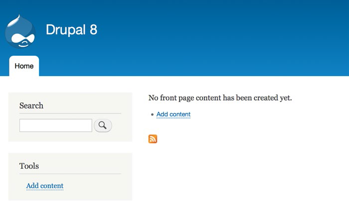
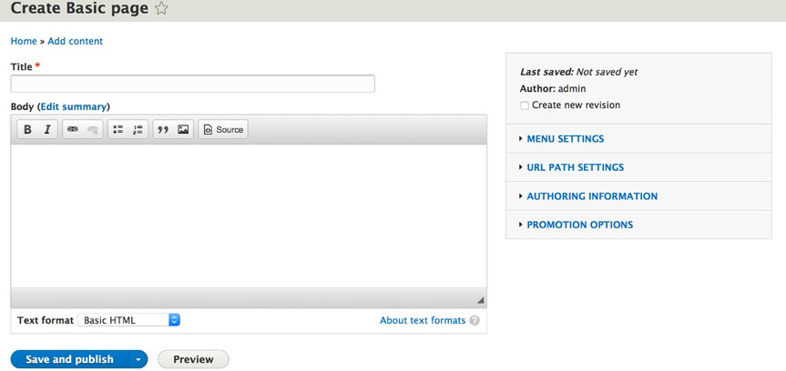
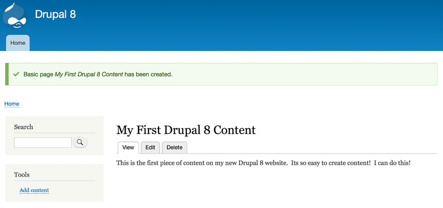

#第1章 Drupal的介绍#

翻译：天哲 遗漏的部分由蹊添加上

本章主要对drupal是什么样的内容管理系统，Drupal的主要组成部分，以及在drupal网站如何创建内容做了基本概述。
 
## 内容管理系统 ##
 
简而言之，一个CMS就是一个软件包，它提供了制作，发布和管理网站内容的工具。 “内容”包括新闻报道，博客文章，视频或照片什么，播客，文章，或者你是销售产品的描述。用更一般的术语描述，内容是由文字，图表，照片，音频 和视频的任意组合，您网站的访客能够阅读，看，听。

一个CMS通常提供了许多功能，能够简化搭建，开发和管理网站，其中包括下列内容：

- 一个管理界面
- 存储内容的数据存储位置
- 将物理页面所需数据与数据库中的信息相关联的机制。
- 用于创作，发布和内容管理的工具集
- 用于创建和管理菜单与导航元素的组件
- 用来定义和应用主题所需的工具集
- 用户管理
- 一个安全框架
- 社交网络功能，如论坛，博客，wiki和调查
- 分类和标记
- 在线表单
- 电子商务功能
 
现在有数以百计的CMSes可用（查看 www.cmsmatrix.org ）。它们的范围从简单的博客为中心的平台，如WordPress，到复杂的企业级内容管理解决方案，如Drupal的。

## Drupal核心 ##

Drupal是用PHP编写以GNU许可形式发布的开源免费的可自由使用的CMS。 

Drupal起源于荷兰大学的学生Dries Buytaert的一个项目。该项目的目标是为Buytaert和他的朋友分享新闻和事件。 在2001年，Buytaert投身到Drupal的开源项目，与社区形成共识，以原来简陋的项目为起点，成为现在全网最强大和功能丰富的 CMS平台之一。个人，团队和社区使用Drupal的功能来轻松发布，管理和组织网站上内容，从个人博客到大型企业和政府网站都可以使用。

标准的Drupal发布版本，被称为Drupal核心，包括可创建典型宣传网站，单个或多个用户的博客，互联网论坛或社区网站与用户内容生成这些基本功能。在Drupal核心中的功能具有编写和发布内容;创建和管理用户，菜单和论坛;并使用网络浏览器基于管理界面管理自己的网站。

Drupal被设计成可以通过下载附加模块和自定义模块来加强功能的内容管理系统。有成千上万的附加模块（被称为贡献或“的contrib”模块）扩展Drupal核心的功能，涵盖的功能广泛，包括电子商务，社交网络，与第三方应用程序和多媒体集成。

Drupal可以在能够运行PHP5.4.5+的Web服务器（包括Apache，IIS，lighttpd的，Nginx的和）与来存储内容和设置的数据库（如MySQL，SQLite的，或PostgreSQL的）的任何计算平台上运行。
 
## Drupal核心 ##

当您下载并安装的Drupal，要正安装的文件通常被称为Drupal核心。核心相当于一个基本网站的“引擎”功能，与其他应用的现成功能一起，创建功能相对完善的网站。 Drupal核心的主要组件功能包括创建和管理
- 内容
- 文件上传/下载
- 菜单
- 用户帐户
- 角色和权限
- 分类
- 论坛
- 次提取并以各种形式如列表和表显示内容
- 基于所见即所得内容编辑器
- 
Drupal核心还包括一个功能丰富的搜索引擎，多语言功能，以及记录和错误报告。

## 贡献模块 ##

虽然Drupal核心可以用来构建功能丰富的网站，也有可能，核心功能不能满足特定的需求。在这种情况下，第一个步骤是通过搜索成千上万的自定义模块，来自世界各地的贡献的开发者Drupal的模块，来解决你的需求。这很可能也是其他人早有同样的功能要求，并已有开发扩展Drupal核心功能的的解决方案来提供给你。为了找到一个贡献模块，请访问 www.drupal.org/project/project_module 的Drupal官方网站。

你会发现一些分类列表和当前类贡献模块的数量（用于所有版本
Drupal的）。此处是分类类型和模块的数量的简单例子（每时每刻都有模块被添加，所以模块的数量是截至写这个例子时的数目）：

- 管理（1145）
- 社区（614）
- 内容（1981）
- 内容显示（1612）
- 内容构建工具包（CCK）（673）
- 开发者（960）
- 电子商务（892）
- 媒体（778）
- 第三方集成（1908）
- 公用事业（1959）

为了找到所支持Drupal8的模块，选择“核心兼容性”搜索筛选器里的8.x的。
最流行的贡献模块（在右边的收缩过滤器列表中选中“最多安装量”），和你可能会想安装的应用模块如下：

- 商务：一个全功能的Web店面模块，提供了所有的推销产品（物理以及电子下载）所需的机制，收集信用卡支付和管理的出货量。如果你想卖的东西在您的网站，这是你将要使用的模块。
- 显示套件：允许你完全通过拖放界面控制你的内容显示。
- 日历：提供创建和呈现日历上的事件列表的能力。
- 备份和迁移：处理按照计划备份drupal数据库和基于之前的备份数据恢复网站数据的功能。是每个成品网站必备的模块。
- 谷歌Analytics（分析）：提供了一个简单易用的表单上设置谷歌分析您的网站。谷歌Analytics（分析）是一项免费服务，跟踪你的网站访问者的数量，以及这些游客来自哪，他们用哪些搜索字词找到你的网站，他们查看了那些网页，同时在您的网站上他们花多长时间，许多其他有用的指标，将帮助您查看和了解的使用您的网站。有关谷歌Analytics（分析）的更多信息，请访问: www.google.com/analytics 。
- Pathauto：通过自动生成一个基于页面标题相对搜索引擎友好的“漂亮”的网址（如 www.example.com/examples 而不是默认的 www.example.com?node=1234 Drupal的URL）。
- 调度：提供在指定的时间将节点内容变为已发布或者不再发布的能力。
- 这允许作者现在创建一个节点点不显示在网站上，直到未来一个特定时间。

##Drupal的主题 ##

主题是Drupal的组件，它定义网站页面的结构以及视觉效果。一个Drupal主题像这样定义您的网站属性：

- 在页面上信息将被显示成多少列（左，中和右的三列布局;窄的左列和宽的内容右侧的两栏布局;一列的布局，等等）。
- 页面顶部是否有横幅栏。
- 页面底部是否有底角栏。
- 是否有导航菜单（在页面的顶部，在横幅兰下方，在
- 右列，等等）。
- 在页面上使用的颜色。
- 用于网页上的各种元件的字体和字体大小（如标题，标题的字体大小，
- 和正文）。
- 图形元素，例如站标。

Drupal核心包含了许多可以使用在你的新网站的现成的主题。您还可以可在 www.drupal.org/project/project_theme 免费下载一个或多个主题，或者按照 www.drupal.org/documentation/theme 的说明创建自己的主题。

## 创建内容 ##

没有内容的网站就像一本书，没有文字，没有新闻的报纸，没有文章的杂志：几乎不值得看。 Drupal使的网站内容的创建，发布和管理更加容易。让我们来通过创建我们的第一篇内容看看它是多么的简单。如果你还没有安装的Drupal，请访问附录，并按照说明一步一步的过程安装和配置Drupal的核心。

获取Drupal内容编辑界面有多种方法。我将重点放在最简单的一种，然后再讨论第2章的其他方法。

在您的新网站的首页，“还没有创建首页内容”的提示信息附近你会看到“添加内容”链接。在左侧栏中，你还会在工具菜单中看到一个“添加内容“的链接（见图1-1）。点击任意一链接：他们都能带你到内容编辑表单，创建您的第一篇内容。

 

**图1-1. 单击任意“添加内容”可开始** 

接下来，您将看到您可以使用的内容类型的列表（见图1-2）。 Drupal8有两个基本内容类型：文章和基本页面。这两种内容类型提供了向你可以写入的内容项和正文区域，输入作者和文本字段。不同的内容类型提供附加元素。在文章的情况下，你必须有输入“标签”对你的内容和图像进行分类的能力。我将在本书后面涵盖“标签”和其他几个内容类型，还有能够创建自定义内容类型的能力。
 
 

**图1-2.选择你的内容类型** 
 
从最简单的内容类型，一个页面，作为你的新网站的第一个内容项目的基础。

单击“基本页面”链接，打开内容创建表单，用于创建内容类型（见图1-3）。在此表单，输入您的第一篇文章的标题，和一些文本到正文。当你输入标题和文章正文之后，单击右侧边栏中的“推广选项”链接，并从选项​​显示的列表中，勾选“推广到首页”复选框。当这个选项被选中，它告诉Drupal在您网站的头版显示这篇文章。如果未选中，请点击复选框。最后，向下滚动到页面底部，并点击“保存并发布”按钮（我将在第二章介绍其他选项）。

 

**图1-3.创建基本页**

点击“保存和发布”按钮，你刚才写的内容马上就显示在你的网站的首页了。

 

**图1-4.瞧，这就是你发布的** 

## 总结 ##

恭喜！你已经能够在你的新drupal网站制作并发布了新的内容了。这本书剩下的部分将涵盖许多其它内容创作，发布和管理功能。你可以利用druapl以自己的方式搭建令人难以置信的网站。
概要

本章重点阐述了什么事cms，dupal核心提供的函数，如何通过贡献模块封装函数、drupal主题和在drupal站点创建内容。第2章将深入探讨的内容创建，发布和Drupal的8管理能力。

