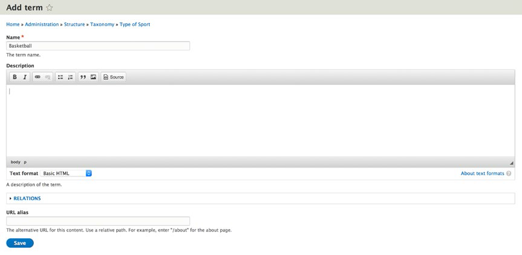
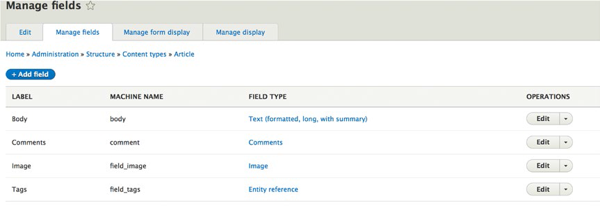
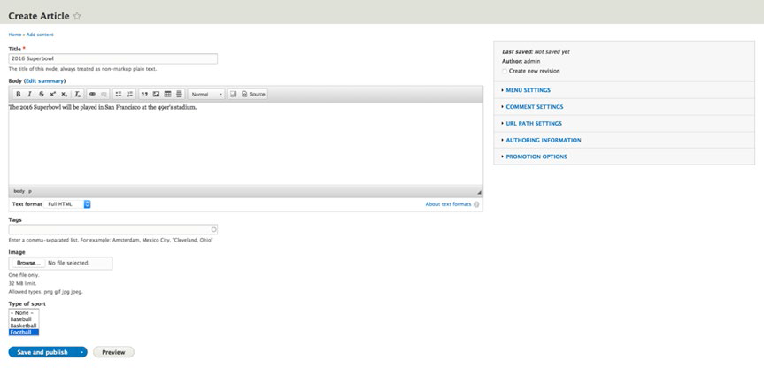
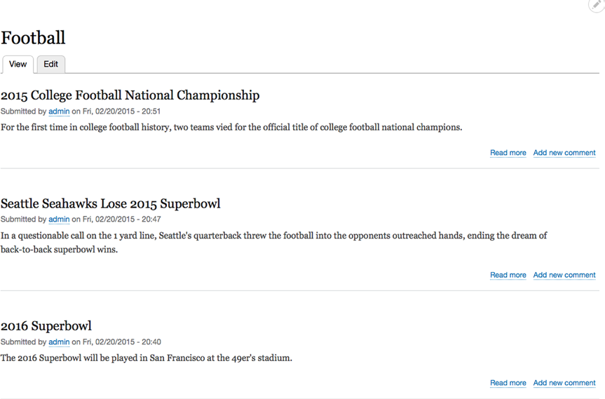
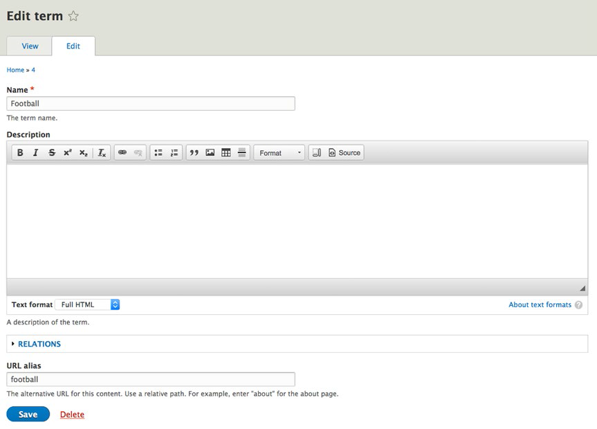

#第4章 分类#

**翻译：蓝眼泪**

分类是 Drupal 新用户最易误解及理解不足的功能之一。它可能是 Drupal 提供的最强大、最有用的功能之一，但是 Drupal 的其他功能已经使新用户应接不暇，因此他们也往往会绕过它而使用其他的功能来实现他们的需求。在本章中，您将通过创建并使用分类术语的方式对内容进行分类，已便于让访客可以轻松地找到某一特定主题的相关信息。

##分类概述##

虽然我们很多人无法对“分类”进行定义，但在日常生活中我们却经常使用“分类”这一方法来管理生活中的事物。例如，你打开厨房，你会发现一个食物的有序组合：所有的调味品都放在架子顶层，罐头食品放在第二层，面食和其他盒装食品放在第三层，第四层则放盒装的谷物。将食品分类并有序的放置，以便于你在做饭的时候可以很轻松的找到需要的东西——这是最简单的分类方法的使用。如果没有这个“厨房分类系统”，可能会造成这样的问题：你所有的材料都随意地放在储藏室，但你很难找到它们，这时你会感到沮丧，也许就丧失了做饭的兴趣而选择点外卖来解决这一餐。

在 Drupal 中，分类可分为两大功能：标签和结构分类。这两个功能都很强大并且可以同时在网站上使用。
标记是分类系统一种简单而有效的使用方式，它可以使作者在一个文本字段中输入介绍内容的关键字。举一个例子，一个作者写了一篇关于替代能源的文章，他可以使用如“太阳能”、“风”和“地热”来作为关键词或标签，以此对文章进行分类。作者创建的关键词通常作为超链接放在文章结尾，访客可以通过它们定位或跳转到使用了相同关键字的其他文章。

标记是自由的，这意味着它由作者来定义他们想用什么词来将内容归类。用标记来归类文章有两个常见问题：一是不同的人会用不同的词来表示相同的概念。例如：一篇关于“雨”的文章可能被一个作者标记为“雨”，被另一个作者标记为“降落”，又被第三个作者定义为“毛毛雨”。一个网站访客想找一篇关于雨的基本概念的文章，可能会在找除了“雨”以外的词时遇到困难。另一个常见问题是拼写错误。如果一个作者用“统治”（reign）来标记关于“雨”（rain）的文章，那么访客将很难通过分类的方式用“雨”来找到这篇文章。

用分类对文章进行归类的第二种方法是结构化分类。在这种方法中，网站管理员创建所有会用于分类的关键词，而作者只需从关键词列表中选择所需的分类的词即可。结构化分类的一个好处是可以分层，这表示术语可以分组来归类文章。我们用体育分类来作为分层的例子，第一层术语可以是“团队运动”和“个人运动”，在团队运动中你可能会看到足球、篮球、棒球、曲棍球、排球和其他团队运动，而在个人运动中你可能会看到高尔夫、游泳、田径以及赛车运动。你可以继续创建运动的层次，直到你对所有体育项目都有了独特的描述。作为一个作者，如果要写一篇关于体育赛事的文章，我可以选择一个或多个已定义的术语来对我的文章进行分类。

结构化分类与简单标记相比，它的一个显著优势是它拥有通过术语类别或个别术语来查找文章的功能。在前一个例子中，你可以具体的查找关于足球的文章，或者你可以用更普通的方式寻找团队运动类别中的所有文章。

确定是否使用标记或结构化分类是一个很重要的决定，它关系到你如何分类展示你的网站。不过在Drupal中你可以同时使用两种途径来为作者提供很好的灵活性。

让我们来看一个现实的例子。假如我们要创建一个聚焦体育新闻的网站，我们的目标人群是那些喜欢关注他们所喜爱的球队发生的事情的人。我们要考虑到人们会在我们网站上如何搜索和浏览内容，我们可能会想通过运动类型来组织文章，如： 
 
* 足球
  
* 棒球 
 
* 篮球  

* 曲棍球  

* 英式足球 
 
人们可能会想通过球队查找体育新闻：  

* 乌鸦  

* 开拓者 
 
* 湖人  

* 攻略  

* 洋基

在这个例子中我们将和前一个例子一样采用结构化分类。我们要先创建一个词汇，这是分层结构中的最高层级。在这个例子中，我们会创建一个名为“运动类型”的词汇，我们将在这个词汇下创建的术语是：足球、棒球、篮球、曲棍球、英式足球。然后我们会创建第二层，这一层会按照球队名称定义术语，例如，我们会将乌鸦和攻略归在足球术语下，会将开拓者和湖人放在篮球术语下，会将洋基放在棒球术语下。
我们会持续创建队名，直到每一个团队都放在了合适的位置。出于演示的目的，我们会一直使用简化的列表。

##创建词汇##

使用分类的第一步是确定和创建你将用于分类网站内容的词汇。你可能只需一个词汇，也可能会需要很多个，这取决于你网站的中心和主题的广度。在网站上要应用词汇的多少是没有一个准确地定义的。最好的方法是根据你的网站内容及涵盖的主题来综合考虑。

如果你的网站主题都是相关的（如：各类运动），那么你需要一个词汇就够了。如果网站主题不是相关联的（如：一个与书相关的网站，可能会以作者、主题、出版商、目标读者等方面进行分类），那么这个网站就要多个词汇才能满足需求。

这取决于网站创建者定义的最适合网站的结构，这个结构包括作者希望网站表达的主题，希望使用的内容架构，以及希望访问者查看的内容。

当你确定了要使用的词汇，点击顶部管理菜单的管理链接，然后点击“结构”（Structure），你将看到一个包含“分类”（Taxonomy）的列表，点击“分类”(Taxonomy）会打开一个页面，该页面会显示出你已定义的所有词汇。默认情况下，Drupal会创建一个名为“标签”的词汇，这个词汇是一个默认的通用容器。如图4-1

 

**图4-1 标签词汇页面**

要添加词汇，点击列表顶部的“添加词汇”（Add vocabulary），会打开如图4-2的页面。在“名称”（Name）输入框中输入“ Type of Sport ”，然后在“描述”（Description）字段输入一个简单的描述。描述字段是可选的，它在分类的管理界面上默认是不显示的，但是当你希望对列表的内容有所说明时可以使用这个字段。 

**图4-2 创建一个新词汇**

输入完成后点击“保存”（Save），然后页面会显示你的词汇相关的术语列表。因为这是一个新词汇，所以该页面的列表是空的，如图4-3所示

**图4-3 新建的词汇**

下一步是创建一个与“运动类型”这个词汇相关的术语列表。要创建列表，点击词汇表上方的“添加术语”会出现如图4-4的页面。在Name字段输入“篮球”，并输入一个简短的描述以扩展术语的含义。

**图4-4 添加术语**

输入术语和描述后，点击保存按钮。 Drupal 会显示一个添加新术语的页面，作为练习，添加几个其他的运动项目，如棒球、足球、英式足球等。当你完成了词汇相关术语的输入，点击breadcrumb部分的“运动类型”回到词汇编辑页面，点击页面顶部的列表处的词汇，打开如图4-5所示的完整列表。

  

**图4-5 术语的完整列表**

到现在，我们已经创建了一个词汇以及将用于内容分类的术语。默认情况下，术语是按照字母顺序排序的，但是在某些情况下你可能需要其他的排序方式。例如，你可能有一个与美国地区相关的词汇，定义了术语东部、中部、山区和西方（East,Central,Mountain,West），如果它们按照字母排序排序的话会是东部、山区、西方、中部（Central、East、Mountain、West排序时中英文的次序不同）。也许你想以从东到西的顺序排序，也就是说顺序应为东部、中部、山区、西方，这是你会需要与默认排序不同的方式排列术语。你可以通过简单的点击及拖拽术语左侧的箭头来实现也想要的顺序排列，排序后记得点击保存，在保存前的顺序调整都是不生效的。

我们现在必须确定哪些类型的内容会使用分类这种方式来归类内容，然后设置我们的词汇以便于它出现在创建该类型内容的创建面板上。

##向内容类型分配词汇##

要想让内容作者为内容分配术语还需要网站管理员对内容类型进行调整。第一步是确定所有你想要与新词汇关联的内容类型，你可以决定将你的网站上的所有内容类型使用词汇分类，也可以决定一部分内容类型适当地使用词汇归类。例如：你有一个关于活动场地的词汇表（如自助餐厅、健身房、庭院、足球场等），你可能会想要限制使用词汇表的内容类型，这个词汇表可能只适用于日历事件的内容类型，而非你的基本页面的内容类型。

举一个例子，我们更新一下测试网站上的“文章”这个内容类型将运动类型这个词汇和标签内容结合起来。
第一步是点击网站顶部的管理菜单，单击“结构”（Structure），点击“内容类型”（Content types）打开内容类型的列表（如图4-6）  

**图4-6 可用的内容类型**

在每一个内容类型右侧的列表上都有一个“管理字段”（Manage fields）的按钮用来管理该内容类型相关的字段。在第5章你会学习如何在你的内容类型中添加新字段，例如，当有人使用那个类型时，为了对收集内容进行扩展，你会希望添加一个文件上传的字段，一个收集特定信息的附加文本框，复选框，无线按钮或者一个选择列表。现在，我们将专注于在内容类型中增加词汇以便于作者可以选择运动类型中的术语。

点击文章描述右侧的“管理字段”，打开将用于添加词汇的表单（如图4-7）。在这个表单上，你会发现一个“添加字段”（Add field）的按钮，点击这个按钮开始添加你的术语字段。

  

**图4-7 管理字段**

在“添加字段”（Add field）页面，选择“添加新字段”（Add a new field）处下拉列表中的“分类术语”（Taxonomy Term）。在标题标签这个字段处，输入一个将会在内容编辑表单中出现的描述性标题，以此告诉作者这个字段要填什么。例如：输入“运动类型”，点击“保存并继续”按钮，在下一个页面你可以选择指定当作者创建文章时可以从列表选取多少个值，默认设置是选择一个术语。例如，我们希望作者可以在“运动类型”词汇中选择多个术语，那么我们就将选择列表中的数值改为无限的。下一步，点击“保存字段设置”按钮，继续页面设置。

在设置页面，我们可以选择更改之前创建的标签，输入将在页面编辑页面出现在这个字段下方的帮助文本，设置这个字段为必填（这表示作者在保存文章前必须选择一个值），然后设置一个在作者未选择时的默认值。出于演示的目的，我们先保留之前设置的标签，输入一个简短的句子告诉作者为文章选择一个合适的值；将必填复选框保留在未选中状态时，作者可以自由选择是否为文章分配运动类型的术语，同时将“运动类型”的默认值设为“无”。在引用类型中，保留默认设置即可。另一个利用视图来自定义列表可选项的方式我将在10章视图中说明。在词汇列表中通过点击复选框选择运动类型，这就表示 Drupal 在作者显示值的时候只能展示运动类型这一词汇的项。要完成新字段的添加，请单击“保存设置”（Save settings）按钮，点击后将回到“文章”这一内容类型的管理主页面。

默认的分类术语是系统自动完成的字段，它们是作者希望添加的术语中很简单的一部分，而且Drupal会查看其是否与已存在的模型相匹配。当作者了解这些分类术语时工作会很容易完成，但在这种情况下，我们需要列出作者要选择的术语列表。点击字段列表顶部展示的选项卡中的管理以改变从选择列表中自动完成的运动类型这一字段部件，并改变从选择列表上自动获取的运动列表的值，改变值后点击保存按钮，作者现在可以在写文章时从“运动类型”的术语列表中进行选择了。

##创建内容时选择一个分类术语

基于我们之前操作的部分，使用“文章”这个内容类型创建一篇新的文章，作者可以从他创作的内容归类中拥有一个可供选择的列表。为了测试这个功能，像之前描述中的那样，点击“创建内容”（Create Content）的链接。从列出的内容类型的列表中，点击“文章”（Article）这一内容类型，当创建文章页面打开后，请注意，页面有一个新的“Type of sport”的选择列表，作者可以在这里将相关的运动类型分配给这篇文章（如图4-8）。通过输入标题、正文、通过选择列表选择一个运动类型来创建一篇文章。 
 

**4-8 创建文章**

点击“保存并发布”按钮，Drupal会向我们展示一个新页面，页面中包含“相关运动”的字段，这个字段下方显示的就是你在“运动类型”列表中选择的值。为了演示分类的功能，创建两个新页面，选择你在前一个例子中选择的分类术语。你最后创建的页面保存后，点击你使用的术语，如图4-9 点击足球  
 

**图4-9 应用了足球分类术语的内容页**

点击这个术语的结果是出现了一个页面，该页面上罗列了其他所有的足球分类术语分配到的页面（如图4-10）
 
  

**图4-10 被分配足球术语的所有页面**

Drupal会自动呈现所有与所选术语相关的文章。这个列表默认是以日期/时间排序的，所以最新添加的文章会在列表顶部。你可以通过更改默认视图来调整文章出现的顺序。我们将会在第9章详细地讲解“视图”（Views）相关的内容。你也应该注意到页面底部的RSS图标，RSS订阅是一个传递外部信息的行业标准途径，如新闻阅读应用程序。

Drupal也可以创建与分类术语相关的所有网页的新闻订阅（RSS feed），点击RSS图标页面会呈现出一个标准列表。

##创建对人和搜索引擎友好的列表##

默认情况下，Drupal创建的内容列表的链接是与分类术语关联的，如图4-11所示  

**图4-11 Drupal创建的网址**

链接的结构是“taxonomy/term/X”，其中“X”是你引用的分类术语的“term ID”。虽然Drupal里可以理解这指的是什么，但是一个人，更重要的是搜索引擎只查看列表的标题和内容无法判断这个链接（URL)。有一个简单的补救方法就是提供一个链接别名。你可以通过编辑分类术语，在添加别名的表单上展示的字段处输入链接来添加别名。回到分类术语列表页，点击页面顶部的管理并选择结构（Structure），在结构页面点击分类（Taxonomy ）链接。在分类页面，点击与你想要提供别名的术语相关联的词汇右侧的“列出术语”，找到你想要更新的词，点击编辑选项卡，在“链接别名”（URL alias）字段（如图4-12），输入一个人们和搜索引擎都比较容易理解的描述性的链接。为了保持链接的一致性与简单性，建议链接由小写字母和连字符组成。在输入链接后点击保存按钮。在浏览器的地址栏输入网站网址及你刚才创建的链接别名，在前面的例子中，链接为http://localhost/football. 
 

**图4-12 分类术语创建网址别名**

##术语分级##

如果你想要对分类术语定义一个分级结构要怎么做呢？  
例如：篮球  
你需要有对篮球内容进行进一步分类的能力：  

* 篮球  
 * 高中   
 * 大学  
     * 一级  
     * 二级  
     * 三级  
 * NBA  
     * 东部  
     * 西部  

幸运的是，Drupal提供了创建术语分级结构的简单机制。现在更新我们的例子，依次点击页面顶部的管理--结构--分类链接，点击添加术语，然后会出现创建术语的页面，我们从添加“高中”这个术语开始。输入“高中”作为术语的名称，然后点击页面底部的“关系”链接，在列表的“上一级术语”（parent）选择“篮球”然后点击保存，继续添加“大学”和“NBA”，上一级术语也选择篮球。创建第三层，输入“师1”为术语名称，在关系选项处选择“大学”作为上一级术语，继续添加直到前边列表中的所有术语都创建完成。产生的结构应该就像4-13展示的列表一样  

 

**图4-13 结果列表**

如果你在保存前忘记了选择父项，你可以通过点击并拖拽箭头来将术语放置在它应该在的层级位置，你也可以通过点击“编辑”按钮修改关系部分的值将术语归类在适当的父项下。我们现在可以内容项分配给父级也可以将它分配给子级。

通过这种方式创建的结果页面现在显示的相关运动是“高中“，点击高中将会呈现一个与”高中“相关联的所有页面的列表。使用视图，这个会在第5章详细介绍，可以为你展示这个层次中的所有内容，例如：所有归类在篮球下的文章，无论是高中、大学还是NBA都会展示出来。

##分配多个词汇

有时候会有这样一种情况，当把内容由一个单一词汇来约束表达的时候你必须要克服内容分类的复杂要求。幸运的是Drupal并不限制内容类型使用的词汇数量。你只需要照着本章之前介绍的那样添加第二个字段，选择你想呈献给作者的不同的词汇即可。

##总结

本章介绍了分类的能力和简单性。我建议你在你的第一个网站上就开始使用分类，因为你越使用它，你会发现使用它的能力向访客提供内容越便利。在讲解书中其他先进功能的时候我会持续使用分类的。
