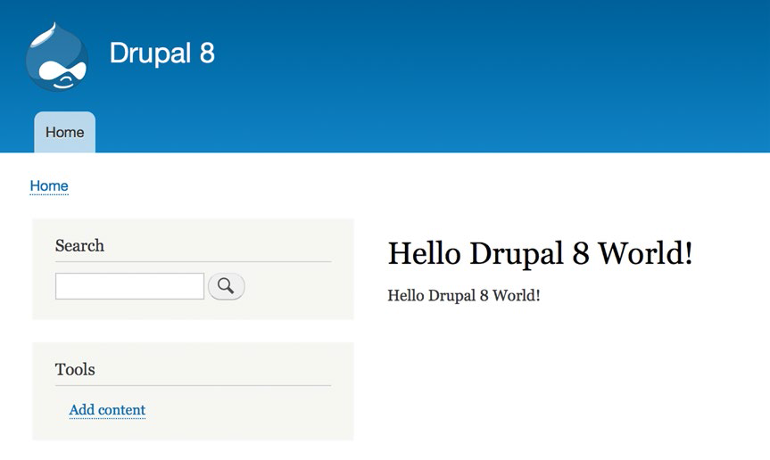

#第12章：模块剖析
虽然可以建立相对复杂的Drupal8站点而无需使用内部模块，但是你需要了解模块的内部运作，才能充分利用模块的特点。在这一章中，我会带你从简单的Drupalqu 8模块开始去了解这些模块。
##你的第一个Drupal8模块
别担心，我们会让它简单化！我们只做一件事，就是把“Hello Drupal 8 World!”在页面中展示出来。我们在这一节的努力将是一个类似于图12-1的页面。

  
**图12-1 你好Drupal8世界！**
###第1步：创建模块目录
第一步是创建一个目录，构成你的模块文件的归属。所有贡献模块（非核心）位于你的Drupal8个网站的根目录下的模块目录。如果您已经安装任何Drupal8核心模块意外的模块，你会在这个目录看到它们。

使用操作系统的文件管理器，或从一个终端窗口，在命令提示符下，导航到你的网站的modules目录，并创建一个自定义的新的目录命名。 Drupal的最佳实践指出，那些不是从Drupal.org下载的自定义模块，应该被存放在一个自定义的子目录。导航到自定义目录和在自定义目录中创建一个名为hello的新目录。

###第2步：创建模块信息文件
下一步骤是创建一个hello.info.yml文件。此文件告诉Drupal的有关你的模块，并提供了出现在网站的管理部分的扩展页信息。使用您喜欢的文本编辑器，创建一个具有以下内容的hello.info.yml文件：

    name: Hello  
    type: module  
    description: 'My first Drupal 8 module.'   
    package: Awesome modules  
    version: 1.0  
    core: '8.x'

第一行指定，因为它是出现在模块页面上的模块的名称。第二行指定，我们正在创建一个模块。 （例如，将使用主题为类型的值）。第三行是模块的描述，这也会出现在扩展页上。包字段为分组模块组合在一起的机制。例如，如果你访问你的站点的扩展页面，你会看到一个数字在一个盒子里有核心的标题所列的模块。我们将使用一些独特的东西对我们的模块，并将其放置在一个名为`Awesome modules`的包中。如果你正在写一个模块，例如，创建新的Web服务功能，您应该使用创建Web服务的其它模块的包名，以确保网站管理员可以很容易地找到你的模块。版本为模块创建一个版本号，以及核心指定了的Drupal版本在此模块用于写入。在我们的例子中，我们记这个模块为Drupal8。

###第3步：创建模块文件
对于我们的Hello模块的模块文件做一件事情：返回我们的模块提供的页面上显示的文字。模块文件可以做很多事情，但对于我们的例子中，我们将只专注于基础知识。
 
使用您喜欢的文本编辑器，创建一个名为hello.module用以下文本的新文件：

    <?php  
    use Drupal\Core\Routing\RouteMatchInterface;  
    function hello_hello_world() {  
       return t('Hello Drupal 8 World!');  
    }  

该文件以开放PHP标记<？PHP，因为所有的模块都用PHP编程语言。我们的模块文件的具体内容是

function hello_hello_world () {

这定义了一个PHP函数，可以从其他模块进行调用。在这种情况下，它是一个命名*hello_hello_world*简单的函数（）。第一个`hello`是模块的名字，在我们的案例hello中。作为一个Drupal的编码标准，所有功能应与模块名称开始，后面跟着一个描述性的名称。

同样，我们的函数做一件事情：一个文本字符串返回到调用此功能的代码。我包装这个文档，然后返回Drupal函数t（）。此功能转换的括号内的任何文字，如果你启用了多语言功能（见第13章）。这是另一个Drupal的编码标准来包装采用t（）函数的所有文本值。

虽然我们的模块很简单，它说明了模块做的基本功能。模块文件是一些模块的主力，并且可以作的我们的示例模块一样简单，或根据需要以满足模块的功能和技术要求的复合物。
###第4步：创建模块的路由文件
Drupal8的基础是Symfony的，一个PHP框架，简化了复杂的基于PHP的应用程序的创建，如Drupal的。 Symfony框架提供了机制，创造一个模型 - 视图 - 控制器（MVC）的应用程序，其中模型代表应用程序运行对基础数据，视图定义用户界面应用程序，控制器是应用程序的主力包括路由来自用户的请求和返回信息返回给视图，以显示给用户。在这个过程中的下一个步骤是创建我们的模块的路由文件，它定义一个访问者将如何访问我们的模块的功能和什么返回值被显示。

在同一目录下，用你喜欢的文本编辑器创建模块的路由文件。在这种情况下，路由文件将被命名为help.routing.yml。该文件的内容应该是

    hello.content:  
      path: '/hello'  
      defaults:  
        _controller: '\Drupal\hello\Controller\HelloController::sayhello'  
      requirements:  
        _permission: 'TRUE'  

代码的第一行代表我们的模块（hello）的名称。下一行表示最终用户将使用访问的模块，这是hello提供的功能的路径。默认值部分提供将返回给最终用户，这是HelloController中的SayHello函数（等下具体讨论）的内容源。要求部分定义什么权限的访问者能拥有访问我们的模块的权限;在这种情况下我们只用TRUE这个词，因为任何人都可以访问此页面。查看Examples模块来得到模块怎么才能限制访问（ www.drupal.org/project/examples ）的更多细节。

###第5步：创建模块的控制器
Drupal8 遵循的Symfony的和PHP 5的面向对象的方法。其中Drupal8采用了关键概念是名为PSR-4标准，它定义代码是如何加载到内存中。一个使用Drupal的早期版本中的问题是，当代码并不需要在那里时，大量的代码加载到内存中时。 PSR-4解决了这一问题，并促成之一就是所谓的命名空间。在我们的路由文件，与_content关联的值开始以\ Drupal\Hello\Controller，它是一个命名空间。 PSR-4定义了一个命名空间直接映射到应用程序的文件结构。 根据Symfony的要求，我们所有的命名空间目录的驻留在SRC命名的目录，它驻留在我们的模块的根目录中。

因此，创建目录，其中我们的模块的下一个组件将属于控制器。虽然在我们的Hello模块的根目录下，创建了一个名为SRC一个新的目录，在src目录中，创建一个名为控制器的新目录。里面控制器目录，我们现在已经准备好为我们的应用程序创建“traffic cop”的控制器。在你喜欢的文本编辑器创建一个名为HelloController.php文件。我们的控制器的内容应该是

    <?php  
    namespace Drupal\hello\Controller;  
    use Drupal\Core\Controller\ControllerBase;  
    class HelloController extends ControllerBase {  
      public function sayhello() {  
        return array(    
          '#markup' => hello_hello_world(),  
        );  
      }  
    }  

我们的控制器文件的开头用PHP开始标签开始，作为控制器使用PHP编写的。第二行定义，我们正在使用我们的控制器命名空间：
 
    namespace Drupal\hello\Controller;
 
第三行定义了我们要继承Drupal的核心ControllerBase类，而不必一切从头开始编写：
 
    use Drupal\Core\Controller\ControllerBase;
 
回忆第4步，在我们使用'\ Drupal\hello\Controller的HelloController :: SayHello'来调用函数以返回内容给现实。类HelloController 是的HelloController::sayhello的第一部分：

    class HelloController extends ControllerBase {

下面的是从你的路由器呼叫的后半部分（HelloController:Hello）。该行代码定义了返回的信息回当访问者访问我们的网站上/hello的URL所显示的页面的功能。

    public function sayhello() {

其余的代码只需调用我们在模块文件 hello_hello_world()创建的功能。该函数返回渲染阵列的Drupal知道如何在页面上显示文本“Hello Drupal 8 World!”，然后返回它回到我们的模块路由器。

    return array(
          '#markup' => hello_hello_world(),
        );

保存此文件，我们已经准备好使用我们的新模块！在访问该网站的管理部分的扩展页面，向下滚动直到看到 Awesome Modules section（见图12-2）。
 

**图12-2 我们的“Hello Drupal 8 World!”模块扩展页**  
勾选旁边模块的名称，然后单击“保存配置”按钮来启用模块，模块启用后您现在就可以测试你的第一个Drupal8模块了！要执行模块，跳转到您的主页，并添加/hello到URL的末尾（我们定义了我们的模块的路由文件的路径）。你应该看到如图12-1前面显示的内容。

##其他模块文件
我们的Hello模块是一个很简单的模块，其目的是帮助你了解一个模块是如何在Drupal构造的最初的学习曲线。现在你知道了非常基本的模块，你可以看看其他贡献模块，甚至是Drupal8核心，看更复杂的模块中创建学习与增加的复杂性相关的文件。您可以在 www.drupal.org/developing/modules/8 了解。我强烈推荐从 www.drupal.org/project/examples 下载.在这个模块你会发现，展示的Drupal8模块是如何构造的，一个伟大的起点，用于创建Drupal8模块的几个例子。
##概要
恭喜！你写了第一个Drupal8模块，并获得你的第一个信心朝着成为一个Drupal模块开发的忍者。本章的目的是给你一个概述，所以你将在获得足够的信息去通过其他模块探索。虽然为Drupal模块开发学习曲线比较陡，这是你采取沿着这条道路的第一步。
