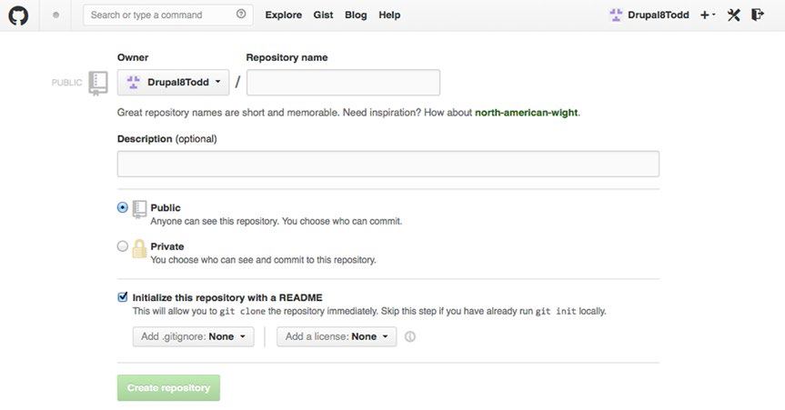

# 第16章 使用 Git

本章会让你对Git有一个大致的了解 。 Git 是 Drupal 社区自 Drupal 7 开发时就采用的一个源代码控制系统。你也许会问，什么是源代码控制系统。其实源代码控制系统就是能够帮助开发者去管理对文档、源代码以及其他信息集进行的变更的工具。比方说你修改了一个文档或一段代码，后来又后悔了，希望它返回到修改之前的状态，就是撤销掉所有的变更，那么源代码控制系统可以挽回这个局面。源代码控制系统的一个主要特征就是：在某一时刻对数字文档进行快照存储，在未来某一时刻可以通过这个快照使文档恢复到之前的状态。

其他有关源代码控制系统的关键环节还包括：把改动推送给其他开发者或系统的能力；采用单一基础代码库，并在此基础上为开发者们在不相互影响的情况下进行同步开发而创建副本（或者叫做‘分支’在技术上更正确），然后在某个时间点上合并所有分支，并解决由于同一文件区块（例如，一行代码）被多人修改而引起的冲突问题的能力。

在市场存在着几个不同的源代码控制系统。 Drupal 社区选择并采用的是 Git。Linux 操作系统的创作者 Linus Torvalds 在他开发 Linux 的时候想要寻找一个真正开源、快速、功能强大还容易使用的（源代码控制系统），因此他开发了 Git。在本章节，我将会讲述一些 Git 的基础功能，你也许会在你的 Drupal 8 网站上使用这些功能。

## 安装 Git

使用 Git 的第一步就是安装它。但是安装它之前，你可查看一下它是否已经被安装过了。在终端窗口的命令提示行中键入`git`后按下<kbd>回车键</kbd>，如果你看到一系列 Git 命令，那恭喜你，你的 Git 早就安装好了。如果你看到的一些以 "command no found"（命令未找到）结尾的内容，那么是时候安装 Git 了。

## 在 Linux 上安装 Git

在 Linux 中安装 Git 只需要一步简单的操作。 如果使用的系统是基于 Debian 的发行版，譬如说 Ubuntu，那么只需在终端窗口中输入`apt-get install git`。如果你使用的不是基于 Debian 的发行版，你可以使用 yum 来安装 Git，在终端窗口中输入 `yum install git-core`。 安装完成后，在命令提示符后键入`git`，按下<kbd>回车键</kbd>，你现在应该会看到一系列 Git 命令。 如果不是这样的话，访问 Git 的官方网站 http://git-scm.com 并查询帮助文档。

## 在 OS X 上安装 Git

在 OS X 上安装 Git 可以通过图形界面来完成。安装包在 http://sourceforge.net/projects/git-osx-installer 上获取。这个简单易用的工具提供一个快速的方法让你在你的 Mac 上安装 Git。下载这个 dmg 文件，点击启动这个安装工具，并跟随指引操作。一旦完成安装，打开一个终端窗口，在命令提示符后键入`git`，按下<kbd>回车键</kbd>，以确保 Git 已经安装好了。如果 Git 已经正确地安装了，你应该会看到一系列 Git 命令，如果不是这样的话，访问 http://git-scm.com 寻找帮助。

## 在 Windows 上安装 Git

要在 Windows 上安装 Git，请从 http://msygit.GitHub.io 下载安装 Git 的 exe 文件。 这个Windows安装包会为你安装 Git 的工具，使你能够在终端窗口中执行 Git 并且提供图形界面工具来管理你的 Git 仓库。 安装完成之后，启动一个终端窗口，在命令行中键入 `git`，按下<kbd>回车键</kbd>。 你应该会看到一系列的 Git 命令。 如果你没看到一系列命令，访问 http://msygit.GitHub.io 寻求帮助。

## 使用 Git

在你使用 Git 的过程中，有一些基本的 Git 命令会让你渐渐的离不开Git这个工具了 。使用 Git 的第一步是创建一个 Git 仓库，这个仓库里存放着你想要进行版本控制的所有东西。让我们使用安装完成的 Drupal 8 作为我们第一个 Git 项目，将它置于源代码控制状态下。使用终端，导航到你的 Drupal 8 项目的根目录下。 在终端窗口中，键入 `git init`，然后按下<kbd>回车键</kbd>。

------

**注意** 如果你已经为这个网站创建了一个 Git 仓库，那么 `git init` 命令会返回一条错误信息。

------

你应该会看到类似于此消息的内容：

Initialized empty Git repository in /Applications/MAMP/htdocs/drupal8/.git/

如果仓库未能成功创建，访问 Git 官方网站，寻找关于你所遇到的错误的帮助。

仓库创建完成之后，下一步需要进行的是添加元素到仓库里。既然我们还没有添加任何文件，我们将会把 Drupal 8 目录下的所有文件添加到 Git 中。要做到这一点，输入下面的命令：

```bash
git add -A .
```

确保你输入的命令最后有那个小点点，因为它代表着当前目录。如果你成功地将所有的文件添加到仓库里，你将会返回到命令提示符状态下，并且没有错误信息显示。当你键入 `git status`时并按下<kbd>回车键</kbd>，你应该会看到一个长长的，包含着新增到仓库里但还未提交的文件列表。

将刚刚添加的文件提交的操作会生成一个快照。在未来当你遇到进行变更后需要恢复到之前状态的情况，你可以回滚到这个快照。 添加和提交文件的频率取决于你或者你的项目团队，关键的目标在于可以及时回滚到之前的状态。那么现在让我们使用下面的命令将 Drupal 8 的文件提交到我们的 Git 仓库中。

```bash
git commit –m "initial commit to the repository"
```

执行提交命令之后，你应该会看到一串关于新节点在你的 Git 仓库中创建的消息，每个提交的文件都会有一条消息。这时如果你执行`git status`命令，你应该会看到"everything is up to date"（所用文件都是最新的）：

```
On branch master
nothing to commit, working directory clean
```

进行到这里，我们已经完成文件提交，并且获得了将文件恢复到刚刚提交时的状态的能力。接下来要进行的是对文件进行一些变更，并提交这些变更。让我们对已有的文件做一些修改，并且添加一个新文件，来看看 Git 对这两种情况是如何作出响应的。首先，在你的 sites/default/files 目录下创建一个文档。 为了演示，我们新建一个名为 test.txt 的文件，里面包含几行信息，这样我们就能看到 Git 在运转。文件创建完成之后，执行`git status`来验证 Git 已经检测到这个新文件。你应该会看到类似的输出：

    # On branch master
    # Untracked files:
    # (use "git add <file>..." to include in what will be committed)
    #
    # test.txt

那么让我们按照提示信息，使用`git add test.txt` 来将文件添加到 Git. 添加文件后，使用`git status`来看看文件是否已经被添加了。你应该会看到类似的输出：

    # On branch master
    # Changes to be committed:
    # (use "git reset HEAD <file>..." to unstage)
    #
    # new file: test.txt
    #

其中，文件名前面的“new file：”表明 Git 目前在跟踪该文件。

现在让我们将这个新文件提交到仓库中，这样我们就可以在未来恢复到现在这个这状态。
使用下面的命令提交文件：

```bash
git commit –m "committing the initial version of test.txt to the repository"
```

提交完成之后，执行`git status`来验证所有文件都已经提交了。你应该会看到那条表示没有东西需要被提交了的消息。

现在让我们对 test.txt 进行一下修改。添加更多的信息到 test.txt 文件当中，看看 Git 能否察觉到这个文件中的变更。 添加完文本之后，执行`git status`。你应该会看到类似的消息：

    # On branch master 
    # Changes not staged for commit:
    # (use "git add <file>..." to update what will be committed)
    # (use "git checkout -- <file>..." to discard changes in working directory)
    #
    # modified: test.txt
    #

Git 识别到了 test.txt 的变更。现在，我们可以使用`git add test.txt`和`git commit -m "modified test.txt"` 将修改版的 text.txt 添加到 Git 并提交。提交完成之后，使用`git log`命令来查看你的仓库的提交历史。你应该会看到两条跟下面内容相似的与你提交的文件有关的提交记录。

    commit d4c24ca1854e53676178141be86246b1a3cb0a1a
    Author: Todd Tomlinson <todd@radiantmediasolutions.com>
    Date: Wed Mar 19 08:27:10 2014 -0700
    
    modified test.txt

    commit 39b5859fa70d1aafacd5c04d7695e715fdfd6bd6
    Author: Todd Tomlinson <todd@radiantmediasolutions.com>
    Date: Wed Mar 19 08:23:04 2014 -0700

    committing the initial version of test.txt to the repository

在上面的列表中，你可以看到两个不同的提交ID(commit ID)。如果你需要将 test.txt 恢复到初始状态，你可以使用那个初始的 commit ID 来进行操作。回滚到以前状态的命令是`git revert <commit id>`。为了撤销我对 test.txt 的变更，我会使用第一个 commit ID，那个以“bd6”结尾的 ID。

```bash
git revert 39b5859fa70d1aafacd5c04d7695e715fdfd6bd6
```

恢复完成后，查看 test.txt 文件，我可以看到文件已经回到我对它进行修改前的原始状态。呦！

现在，你已经有足够的基础信息来搭建你的本地 Git 仓库并存储你的变更。但是你所有的变更都只是本地地存储在你的笔记本、台式机或者服务器。同时往往你可能希望你的代码仓库能够被别人浏览并且/或者修改。为你的 Git 仓库提供访问管理的解决方案有好几个，而 GitHub 是其中很受欢迎的一个，同时也是本章将会为你介绍的那一个。

## 使用 GitHub

使用 GitHub，你可以与他人共享你的 Git 仓库，方便你在你的笔记本或者台式机进行开发而网站驻留在远程服务器的状况。在这些场景中， GitHub 提供一个可以通过互联网访问的环境，而且如果你觉得你的仓库可以开放大众访问，这项服务是免费的。你可以通过每月支付少量费用升级你的 GitHub 账号，你就可以创建私有仓库，这样只有那些被授予权限的人才能访问。为了演示，我们将会使用免费版的 GitHub。 如果你还没有账号，访问 https://GitHub.com 并注册一个新的账号。

注册账号后，第一步是创建一个仓库。在你的 GitHub 登录页面（登录后的第一个页面），你可以看到一个或者多个用来创建创库的链接和按钮。点击其中一个链接，你会看到类似图16-1的页面。



**图16-1 创建新的 GitHub 仓库**

为了创建一个仓库，在“仓库名称(Repository name)”字段中输入一个名称，在描述字段(description)中输入一段描述，并且在“添加 .gitignore(Add .gitignore)”选择列表中，选择 Drupal。

.gitignore 包含一些你希望 Git 不去跟踪的文件名。 就 Drupal 的情况来说，这包含本地配置文件，例如网站根据本地的执行环境而定制的 settings.php。 通过忽略 settings.php，你可以省去每次从主仓库中拉取代码后需要进行的一系列调整，比如说数据库配置。

GitHub 上的仓库创建完成之后，下一步是将你本地的仓库推送到 GitHub。在你的 GitHub 仓库页面的右侧，你可以看到一条克隆URL（clone URL)。复制那个URL，因为你将你的本地仓库推送到 GitHub 时需要它。

这个过程的第一步是在你的本地机器上建立 GitHub 联系。在你的 Drupal 8 站点根目录下，使用下面的命令，添加一条指向你的远程 GitHub 仓库的引用。记得粘贴克隆URL（clone URL）来替换 `<clone url from GitHub>`:

```bash
git remote add origin <clone url from GitHub>
```

当你添加完远程仓库后，下一步是在你试图推送本地仓库到 GitHub 前，将在 GitHub 上已经存在而本地没有的文件变更拉取到本地。当你试图将变更推送到 GitHub ，而同时远程上面存在着一些本地没有的变更，Git 会告诉你，你的分支落后于远程分支，你需要先将这些变更拉取下来。 因为我们在 GitHub 上面添加了一个 .gitignore 文件，远程仓库中确实含有一些本地没有的变更。要解决这个问题，使用下面的命令：

```bash
git pull origin master
```

这个命令会将 GitHub 上面所有的变更拉取下来，并且与本地的仓库合并。下一步是将我们本地的仓库推送到 GitHub， 因为此时我们的 GitHub 仓库基本上是空的。使用下面的命令将我们的 Drupal 8 站点推送到远程仓库：

```bash
Git push origin master
```

我们的变更推送完成之后，本地仓库与远程仓库是同步的。当你在本地仓库中添加或者修改文件，你需要将它们推送到 GitHub 上面，这样其他人就可以访问它们了。这个过程是相当简单的：

1. 使用`git status`查看哪些本地文件被添加到你的 Drupal 8 实例，或者哪些文件被修改过。
2. 从这个添加和修改的文件列表中，使用`git add <文件名>`将他们添加到 Git。（使用`git status`命令列出的真实的文件名替代`<文件名>`)。如果你在同一个目录下有几个文件被添加或者更改，你可以通过使用`git add <目录名>`添加那些文件所在的目录来完成同样的任务。
3. 使用`git commit -m "一些用来描述正在提交的变更的消息"`来本地提交你的变更。你可以在每一个文件添加后（译者注：添加到暂存区）进行一次提交或者在你将有所新增或者变更的文件添加后进行提交。这个取决于在某一问题上你想要的回滚粒度。在大多数情况下，在添加一组文件后进行提交就足够了。
4. 本地提交完成之后，是时候将他们推送到 GitHub 了。使用`git push origin master`来推送这些变更。如果你的 GitHub 仓库上有多人操作，当你推送文件时可能会遇到一个错误情况：你的主分支落后（远程分支）X个提交。只需要执行`git pull`来下载并合并这些变更，然后重新执行`git push origin master`。当你修改的文件同时被别人修改了，Git 会报告一个合并冲突。 Git 会将有用的信息写入到在文件中冲突发生的地方。检验文档并且解决那些问题。关于解决合并冲突的更多信息，可以查阅 http://git-scm.com/documentation 上的 Git 文档。

随着你的 Drupal 8 站点已经上传到 GitHub，你可以让其他人访问你的仓库，这样他们可以下载你的仓库，并且随意地提交变更到你的仓库。如果你已经升级了你的 GitHub 账号，你需要跟随 GitHub 仓库登录页面上的步骤为你的仓库添加访问控制。如果你没有升级你的 GitHub 账号，你就不需要任何的访问控制，因为默认情况下，免费账号都是公开访问的。要将你的 GitHub 仓库克隆到你的笔记本、台式机或者服务器，你可以使用 `git clone` 命令或者在你的仓库登录页面上使用下载 ZIP（Download ZIP）按钮来下载 zip 文件。最佳的方法是使用 Git clone来拷贝这个仓库。 要做到这一点，只需复制你的 GitHub 仓库登录页右侧的 “HTTPS 克隆 URL （HTTPS clone URL）”，然后执行下面的命令：

```
git clone <clone URL> <target directory>
```

使用你的 GitHub 仓库登录页中列出的真实 URL 替代 `<clone URL>`。示例如下：

```
git clone https://GitHub.com/Drupal8Todd/drupal8.git drupal8
```

上面的代码会将 GitHub 仓库克隆到名为 drupal8 的目录中。克隆完成后，我就可以使用、修改、添加到仓库、并且随意地提交这些变更到 GitHub 仓库中。网上有大量文档解释如何在 Git 网站上管理多人开发的 Git 仓库，这些内容包括创建独立分支，让在开发者在上面进行修改，然后在他们准备好的时候合并回主分支。

## 在 Drupal.org 上使用 Git

你也可以使用 Git 来克隆 Drupal 或者它的模块和主题。Drush（参见第15章）使得下载、更新模块和主题变得简单，然而你也许会有想要回馈修改到 Drupal 核心或者一个社区模块或者主题的时候。这样你需要使用 Git 来贡献你的修改到 Drupal.org 或 一个模块仓库，或者一个主题仓库。跟随本章前面介绍的步骤来克隆一个远程仓库，访问 www.drupal.org/project/drupal 并点击页面顶部附近的"version control"链接。在结果页面当中，你会看到关于如何克隆仓库的指引。每一个模块或者主题的登录页面上都有这样的"Version control"链接。你也可以按照前面介绍的步骤来克隆模块或者主题的仓库。有关如何贡献代码给社区的指南，请访问 www.drupal.org/contribute/development。

## 总结

你第一次能够将文件恢复到之前的状态的时刻，将会是由衷赞美那些创作像 Git 这样的源代码控制系统的人的日子。它可以将文件从备份中恢复过来，然而实际情况是，你敲两下键盘就可以相对轻松地将一个文件或者整个网站回滚到之前的状态。你第二次赞美 Git 创作者的时候，应该是你的网站需要多人共同开发的时候，需要不同开发者贡献各自的代码到这个项目上。花点时间去学习 Git 的基础，可以让你免除一生中，那些因为你尝试通过质量不一的备份，将网站恢复到之前状态而出现的头痛，心痛，甚至偶尔的通宵达旦。
