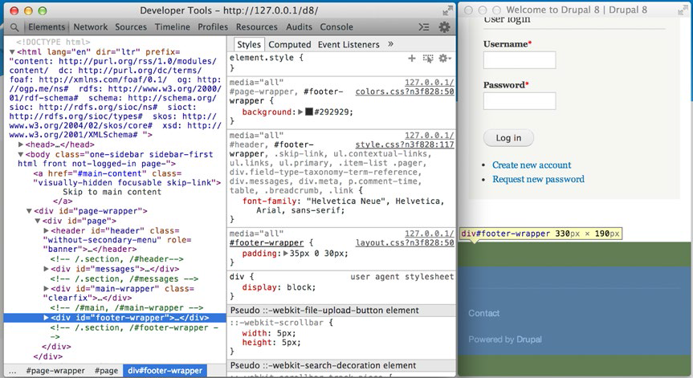

# 第十八章 响应式网站#

##创建一个响应式网站

翻译：蹊

就在几年前，智能手机和平板电脑并不存在，如今我们生活在一个分析家预测下的手机和平板电脑的网站流量于2014年超过笔记本和台式电脑的世界里。我们生活在一个移动端的世界，作为Drupal网站建设者，重要的是要解决日益增长的智能手机和平板电脑，在我们建立新站点的时候，开始优先考虑移动端，这对我们来说是明智的。 大多数的用户访问我们的网站是在较小的屏幕上，无论他们使用什么设备，（Drupal）都能提供了不起的用户体验。 		

幸运的是，Drupal 8 能处理在不同宽度屏幕上渲染站点的挑战（手机，phablets，平板电脑，笔记本电脑，台式电脑，电视）在这一章里，我们将着眼于利用Drupal 8响应式工具和响应式主题，以及步入基本的CSS主题处理响应性。
 
##定义响应式
 
你听说过“响应式”和“移动友好度”，但是网站响应式到底意味着什么？简单的说，响应式意味着你的网站在不同宽度屏幕的多种设备上可以浏览和使用，而无须滚动很远，在小型设备上阅读，内容依旧大小合适。

响应式也意味着，你的用户访问网站时，用户体验自动适应设备。例如,如果你的站点的某些元素在小型设备上显示不佳，你可以选择访问者使用小型设备时不显示这些元素，但是访问者使用笔记本和台式机时仍可以显示。响应式也可能意味着利用设备的功能，如手势或滑动浏览你的网站，而不是要求更多传统的指向-点击的界面。无论你选择哪种定义，响应式设计的基本概念是使你的站点在所有设备均可用。

##如何设计响应式网页
 
响应网页设计作品通过结合检测网站访问者使用的设备的屏幕宽度，利用CSS定义元素基于屏幕的宽度如何在页面上显示。比如一个页面,该页面有三个等宽列，每个占屏幕宽度的33% 。如果你在配有15英寸屏幕1680像素的笔记本电脑的页面浏览，每列宽约560像素则该网站会看起来不错（见图18-1）。

##制作你的响应式站点

当你看到市场的各种设备,你会发现你可能需要在你的css文件里用几个 media queries 去解决你的站点在不同设备上的渲染。 media queries 的个数取决于你的页面在屏幕上缩放的时候，内容的格式出现多少变化。如果你的站点是单栏设计，那么你能够侥幸不使用 media queries，多数站点不止一栏，甚至单栏站点也需要为横向菜单做出调整。
 
##制作你的响应式站点

制作你的Drupal8 站点有三个基本选择：
 
-	从 Drupal.org 选择一个现成的主题，含有 media queries 定义的跨设备工作的主题样式表和css。

-	选择一个初始主题，比如，从 Drupal.org 下载Zen这个主题，在该主题的响应式框架上构建。
　　
-	采用无响应式的主题，添加 media queries 和 width-specific CSS，使得站点在任何宽度都能渲染正常。

每种方法都有其优点，取决于您的CSS的合适程度和你识别页面上的元素需要做出改变的能力，这种改变基于访问站点的游客的屏幕宽度
 
我用得最多的解决方案是第二个选项，从Zen建立子主题，然后定制它来满足我的客户的需求。无论您选择哪种方式， 都值得购买 Jonathan Fielding 的这本书 “Beginning Responsive Web Design with HTML5 and CSS3” (Apress, 2014)，去指导你沿着这条路往前走。

##浏览器工具帮助你测试你的响应式主题
 
在选择和安装所需的主题后，最好下载浏览器插件，这样可以很容易看到你的站点在不同宽度设备上的效果（除非你足够富有去购买市场上每一种设备）。Chrome被称为响应式网页设计测试的优秀工具。谷歌商店提供了一个免费的插件，提供常用设备的下拉式列表。单击工具栏上的工具图标,你会看到设备列表(见图18-4)。选择列表后，一个新的Chrome窗口就会打开，显示你的站点在那个设备上的效果。Firefox和Safari也有类似插件，工作一样好。

##修改普通css解决响应式

针对iphone4的特定元素。加入以下 media query 和css相关条目，在iphone4或更小的屏幕的设备上能特殊变化。

@media all and (max-width: 320px)

你可能需要调整普通元素，列宽，字体大小和图像尺寸。用浏览器的响应式页面设计工具查看站点，这会帮你识别哪些元素需要改变。

##修改普通css解决响应式

其中的第一要考虑的事情是，当设计一个响应式网站需要改变固定的像素宽度和基于点的字体大小。多年来，我们一直在设计像素完美的站点，但响应式设计，我们需要将我们的思维从精确的像素转向百分比和ems。如果你是一个有经验的设计师和css开发者，改变你看待设计和用css实现设计是最难的一个方面。一旦您完成了转型，这个过程将是比较简单的——但是，我们要开始思考页面上的元素尺寸将要消耗的显示宽度的百分比。如果你留在固定的像素宽度，其结果将是您的小屏幕设备的访问者要水平滚动才能看到你的网站完整宽度。举个例子，用你的智能手机查看whitehouse.gov。不幸的是，这个网站没有响应式（到2015年初），需要你用你的手指向右滚动，才能看到该网站的整个宽度。

其中第一件事是检查页面上任何元素在小屏幕浏览时，是会导致你的站点缩小以适合窗口，还是需要你向右滚动去看你的页面的完整宽度。Drupal站点的典型元素包括 regions，blocks，panel panes，和views 经常被要求进行调整。这些元素通常会被设为固定像素宽度，要改成响应式，需要设成百分比宽度。

要确定改变哪些CSS元素，使用谷歌Chrome Responsive Web Design Tester，只需右键单击您要更改的元素，然后选择 Inspect Element 选项。（见图18-5）

 

图18-5。使用Chrome的检查元素工具

响应主题变成了一个与 media queries 结合的相对简单的任务，像Chrome 的 Responsive Web Design Tester 这种浏览器响应式设计工具，右键单击项目就能识别哪些css元素是你想要改变的。剩下的唯一一件事情就是用你的 media query 的 brackets 添加css选择器改变css属性，比如把宽度调到一个合适的值，浏览器完成剩下的事情。

从响应式设计到表现适宜的跨越设备宽度，有一个学习曲线
。旅程从第一步开始，你现在有足够的知识兴致盎然的走出去。

##本章小结
**概要**

在今天的移动世界，建立一个网站，如果不是响应移动设备的网站，那么你的大部分站点访问者会在用户体验上有挫败感。花一些时间给你的css文件增加一些 media queries 和 css overrides，您的网站的访问者会更开心。虽然不可能总是取悦所有的人，至少试图解决您的网站访问者将要使用的设备是个好主意。正如你在本章中看到的，它确实不难，而且实际上很有趣！