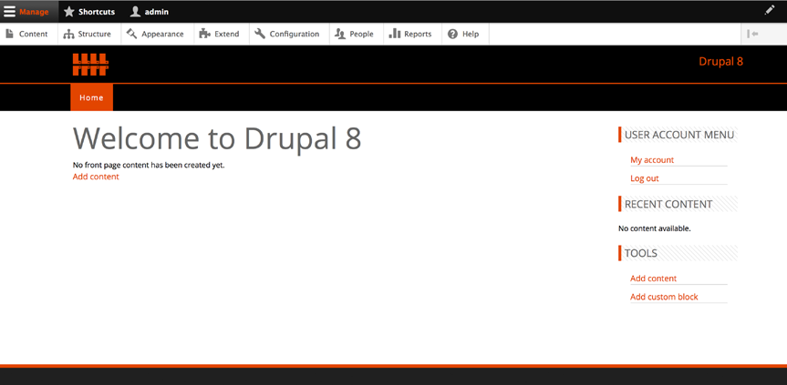
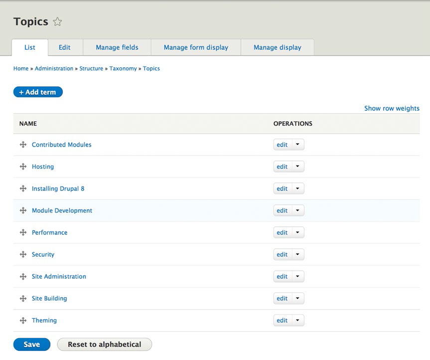
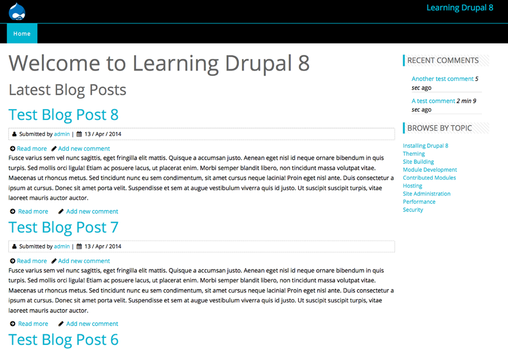
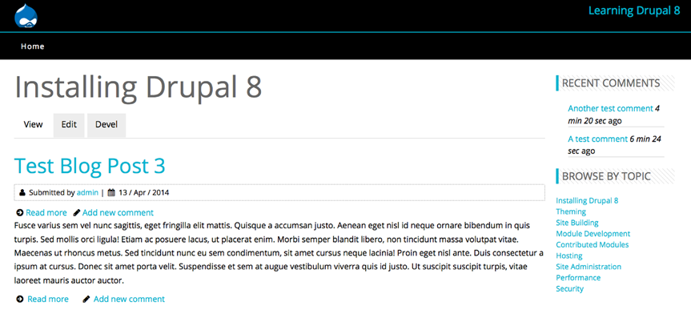

# 第十九章 创建博客网站 #

翻译：夏小雪

截至2015年4月，大约有2.297亿个Tumblr博客，7580万个Wordpress博客，数以百万计的Blogger博客、Drupal及其他平台建立的博客，保守估计，这些博客网站大约占所有网站类型数量的33%（根据 www.internetlivestats.com 的统计目前共有约9.23亿个网站），也就是说十亿网站里有近三分之一的是博客。平均每天发布的博客文章竟有300万篇之多（Technorati）。 Drupal网站建设者光是建立博客类型的网站就足够忙的了！

在本章节中，我将用Drupal 8核心模块建立一个专注于drupal 8学习的博客网站，以此示范使用drupal轻松打造网站的过程。大家可以跟着一起练习，也可以将它作为创建自己博客网站的引导性范本。准备好开始制作你的博客网站！

## 明确博客网站需求 ##

如前章节所述，开发任一网站都要从需求入手。在本例中我们的博客网站需求有以下几点：

1. 基于简单的内容类型创建带有标题、和主题图片的文章功能；
2. 要有分类及通过主题浏览内容的功能，主题包括贡献模块、托管主机、安装Drupal8、开发模块、性能、安全、站点管理、站点建设、主题皮肤；
3. 制作内容的易用编辑工具，推荐所见即所得编辑器（WYSIWYG editor）；
4. 基于发布日期的文章列表功能，时间降序排列；
5. 分类浏览文章功能；
6. 文章评论功能。

针对前述需求，我们可以考虑如何用Drupal满足这些需求，根据需求我们的解决方案如下：

1. 使用文章（Article）作为博客的基本内容类型（content type），这一内容类型可解决博客内容的所有需求，文章包括一个标题字段（title）、内容字段（body）和图像字段（image）；
2. 使用分类（taxonomy）对文章内容进行主题归类。建立一个以话题为术语（term）的词汇表（vocabulary），在文章内容类型中建立一个分类术语引用（term reference）的字段供选择主题；
3. Drupal 8 核心提供了一个所见即所得编辑器；
4. 创建一个按发布日期降序排列的文章摘要列表视图（view）；
5. 创建一个话题词汇表的分类术语列表视图，将视图以区块形式显示，为每一个术语添加该分类列表页面的链接；
6. 文章评论默认启用。

## 安装 Drupal ##
在明确了需求与解决方案之后， 创建一个博客网站的下一步是安装 Drupal。按照附录A的步骤安装Drupal，可以安装在在本地，或者你的服务器上，或者共享主机上，或者使用Pantheon和Acquia提供的服务。

## 安装及创建主题 ##

安装好了Drupal之后，下一步是选择一个主题。你有以下这些选择：

* 从零开始创建主题；
* 从Drupal启动主题中选择，并且定制内容已符合你的需求；
* 在 [www.drupal.org/project/project_theme](http://www.drupal.org/project/project_theme) 上选择一个接近你需求的主题，然后针对特定的需求修改CSS和布局；
* 在 [www.drupal.org/project/project_theme](http://www.drupal.org/project/project_theme) 上选择一个符合需求的主题直接使用；
* 从 Drupal商业主题网站中购买一个付费主题；
* 将别的CMS上的主题（比如 Wordpress）转换为 Drupal 8 的主题；
* 使用Drupal 8 的任一标准核心主题。

在本例中，我们选择第四个方案。 访问 [www.drupal.org/project/project_theme](http://www.drupal.org/project/project_theme) ，过滤条件选择兼容 Drupal8.x，然后搜索。经过搜索浏览，我们选择了最接近需求的主题， Gratis。 按照第六章的叙述，下载安装Gratis，然后设置它为我们这个博客网站的默认主题。完成以上步骤之后我们开始建设我们的博客网站（如图19-1）。

**图19-1 安装免费主题Gratis**

配置主题的下一步是设置LOGO和站点名称，移除安装Drupal 8 的时候默认开启的区块。

设置LOGO标志：点击管理菜单的二级菜单中的外观（Appearance）链接，点击刚才选择并安装的主题（本例中为Gratis）旁的设置（Setting）链接，取消选中“使用主题提供的默认标志（Use the default logo supplied by theme)”，上传你的LOGO标志然后点击“保存设置（Save configura）”按钮。

更新站点名称：点击管理菜单的二级菜单中的配置（Configuration）链接，点击配置页面中的“站点信息（Site information）”链接。考虑到我们正在建设的是一个专注于学习Drupal8的博客网站，那么现在在“站点名称（Site name）”栏位中输入一个合适的标题吧，接着点击“保存设置（Save configura）”按钮。

最后一步是移除安装Drupal8时默认建立并启用的区块。点击管理菜单的二级菜单中的结构（Structure）链接，点击“区块布局（Block layout）”链接。通过将区块的区域列修改为“无”来移除所有的自动显示的区块。完成后点击页面底部的“保存区块（Save blocks）”按钮。现在网站的基本工作已经完成，下一步我们将对内容按话题进行分类。

## 创建分类 ##

我们的博客是专注于Drupal 8学习的网站，在前面的内容中我们明确了需求，其中一个是按话题来浏览内容的功能，因此我们需要创建一个名为“话题”的分类词汇表，建立需求2中所列的术语（贡献模块、托管主机、安装Drupal8、开发模块、性能、安全、站点管理、站点建设、主题皮肤）。

要创建词汇表，点击管理菜单的二级菜单中的结构（Structure）链接，选择结构页面中的分类（Taxonomy）链接。点击“添加词汇表（Add vocabulary）”按钮来创建一个新的词汇表，名称为“话题（Topic）”。添加需求2中需要的术语（贡献模块、托管主机、安装Drupal 8、开发模块、性能、安全、站点管理、站点建设、主题皮肤）到词汇表中。完成以上内容，话题词汇表列表页面将如图19-2所示。

**图19-2 话题词汇表**

## 更新文章内容类型 ##

接下来我们要在文章内容类型中创建一个用来确定博客发布内容所属话题的新字段。选择结构（Structure）➤内容类型（Content types）➤文章（Article），然后选择“管理字段（Manage fields）”链接，然后创建一个新的字段，字段类型为分类术语（Term reference），使用话题词汇表作为这个字段的基本选项。关于更多添加字段的细节，请查阅第五章。在文章内容类型中添加完这个字段后，创建新文章的页面应如图19-3所示，它会有一个话题词汇表的术语列表。

**图19-3 添加话题到文章内容类型**

我们要对内容类型进行的另一个更改是关闭自动发布新微博到网站首页的功能。我们要在下一步创建的视图中控制页面的展示。接下来实现关闭自动发布到首页的功能，点击“编辑文章内容类型（Edit Article content type）”页面顶部的编辑选项卡，选择表单底部垂直选项卡中的“发布选项（Publishing options）”，取消选中“推荐到首页（Promoted to front page）”并点击“保存内容类型（Save content type）”按钮。现在我们可以通过使用文章内容类型赖发布博客了。

## 创建视图 ##

在网站建设过程中的下一步是创建一个渲染网站内容的视图，我们需要以下两个视图：

* 发布日期降序排列的摘要列表，页面顶部显示最新的博客文章
* 话题分类词汇列表，向网站访问者提供便捷的方式浏览他们感兴趣的话题的帖子。

在创建视图之前，让我们先有一些文章内容以便之后能够即时直观的看到视图显示效果。我们来添加一些虚拟的博客文章（参考第二章），为它们选择不同的话题（比如主机托管，性能，主题皮肤）。创建完这些博客文章后，我们就可以开始创建最主要的视图了。点击管理菜单第二层中的结构（Structure）链接，选择结构页面中的视图（Views）链接。点击“添加视图（Add new view）”按钮，在“视图名称（View name）”栏位输入“博客文章（Blog posts）”。然后修改视图设置，在“类型为（of type）”选择列表中选择文章（Article），最后，点击“保存并编辑（Save and edit）”按钮。我们将要创建一个区块显示，因此点击添加（Add）按钮并在显示类型列表中选择添加区块（Block）。然后对该视图做以下更改：

1. 点击“显示名称（Display name）”按钮，把值从“区块（Block）”变更为“博客列表（Blog Listing）”。
2. 点击标题（Title）链接，然后输入“最新发布博客（Latest Blog Posts）”作为标题。
3. 点击显示（Show）链接，把值从“字段（Fields）”改为“内容（Content）”。当“查看模式（Row style options）”出现时，选择摘要（Teaser）模式，然后按应用（Apply）按钮。
4. 排序标准（Sort Criteria）选项应该已经被设置为按内容发布时间降序排列，这种排序标准将会把最新发布的文章放置在文章列表的顶部。
5. 按下保存（Save）按钮来保存此视图。

我们要创建的第二个视图是话题词汇表的分类术语列表视图。我们将使用这个列表作为导航到术语列表页面的菜单以展示所有分配给该话题的博客文章。点击管理菜单第二层中的结构（Structure）链接，选择结构页面中的视图（Views）链接。点击“添加新视图（Add new view）”按钮，输入“博客话题（Blog Topics）”作为视图名称。在视图设置的显示（Show）列表中选择分类术语（Taxonomy terms），在“类型（of type）”选择列表中选择话题（Topics），排序依据（sorted by）栏位设置为不排序（Unsorted），点击“保存并编辑（Save and edit）”按钮后继续。

我们要将这个视图作为区块显示，因此点击添加（Add）按钮并在显示选项中选择添加区块（Block）来创建一个新的区块显示。点击“显示名称（Display name）”按钮，在“管理名称（Administrative name）”栏位中输入“话题菜单（Topics Menu）”，然后点击应用（Apply）按钮。点击标题（Title）链接，然后在标题（Title）栏位中输入“按话题浏览（Browse by Topic）”，然后选择“应用全部显示（Apply(all displays)）”按钮。该视图这样就保存好了。

现在我们已经针对需求做好了视图，下一步就是将视图放进页面。

## 放置区块 ##

完成了视图以后我们就可以把这些创建好的区块放进页面了。点击管理菜单第二层中的结构（Structure）链接，选择结构页面中的“区块布局（Block layout）”链接。点击博客文章：点击博客列表链接右侧的“放置区块（Place blocks）”并选择“内容（Content）”作为列表显示的区域。我们想要限制这一区块显示，让它只出现在站点首页而不是每一页，因此选择配置区块底部垂直排列的页面（Pages）选项卡，然后在“在特定页面显示区块（Show block on specific pages）”表单中选择“为列出的页面显示（Show for the listed  pages）”。在文字输入框中输入<front>，这是Drupal默认的首页地址快捷方式，然后按下“保存区块（Save block）”按钮。

下一步，在“放置区块（Place blocks）”中选择博客话题：话题菜单（Blog Topics: Topics Menu）区块，然后把它放在主题提供的其中一个侧边栏里。评论功能已经启用，所以我们也同样希望在我们的网站能够有一个列表来展示最新评论。 Drupal 8默认提供了一个区块来完成此需求。从“放置区块（Place blocks）”框内选择“最新评论（Recent Comments）”区块，然后把它与博客话题菜单区块放在同一个侧边栏内。现在，你的区块布局应该类似图19-4。在离开区块布局页面前记得保存区块。

**图19-4 区块显示区域配置**

在完成测试博客文章发布，测试评论发布和配置网站区块布局之后，最后的成品看起来很不错哟！（如图19-5）

**图19-5 最终产品**

随便点击任一博客文章标题或者“更多（Read more）”链接将会带你到文章内容详细页面，点击侧边栏任一话题链接则会带你到该话题下的文章列表页面，列表页标题是分类术语名称，如图19-6所示。这是一个简单却又十分有有效的用分类术语过滤内容的解决方案！

**图19-6 话题页面**

## 本章小结 ##

利用 Drupal 8 核心，我们只做一些简单的步骤就创建了一个博客网站。这是一个很好的开始，而且你也可以利用本章节介绍的方案去做别的功能，比如创建一个按月显示的博客文章视图，让网站访问者能够互动的论坛，或者别的任何你希望实现的其他功能。使用Drupal做解决方案你仅仅只会被你的想象力，你的技巧和花费时间所限制。

在下一章，我们将在Drupal上围绕建立企业网站的需求来扩展解决方案。
