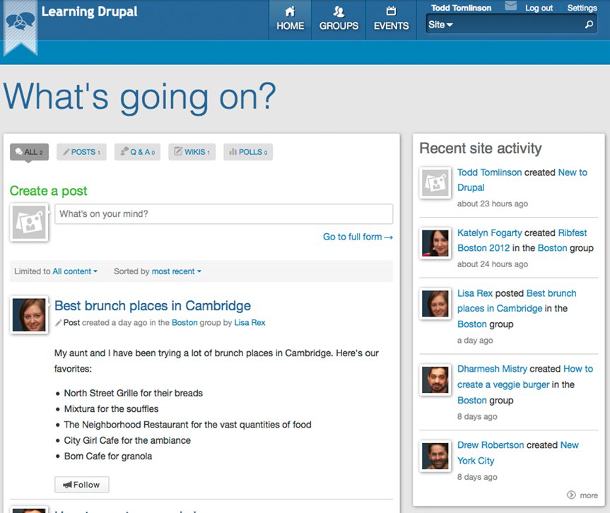
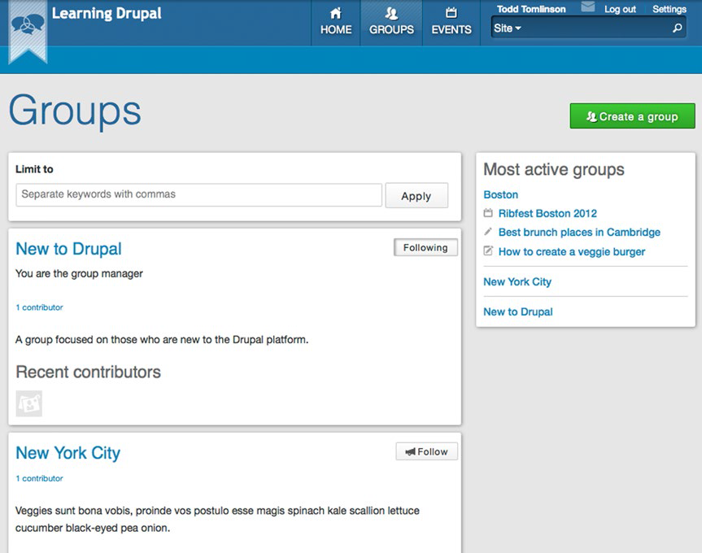
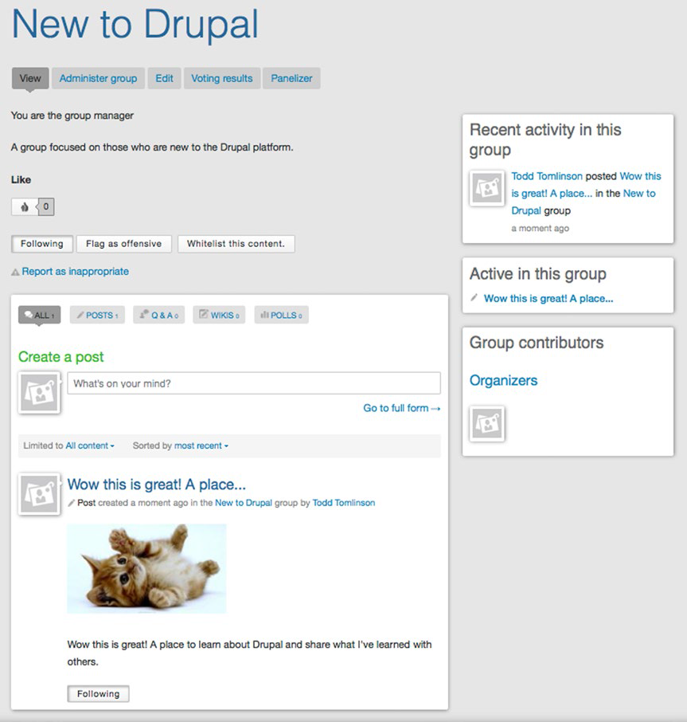
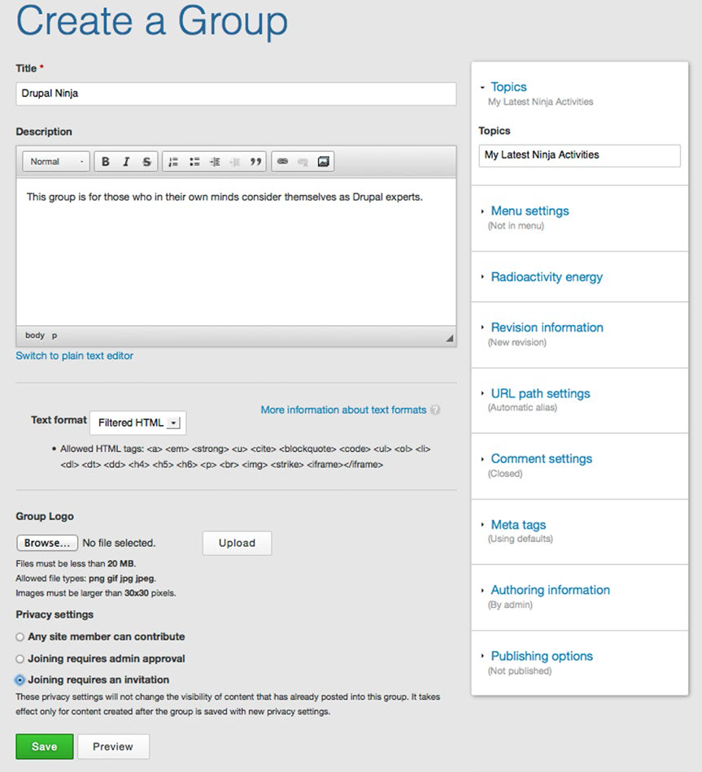

# 第二十一章：构建社区网站   #

翻译：Viving

在过去的几年里，人们的在线社区聚合能力出现井喷式增长。你能想到的几乎所有领域都有在线社区————从技术（think Drupal交流社区！），体育（比如，某足球俱乐部的球迷社区），娱乐（比如，某种流行音乐的爱好者交流社区），到食品、营养、划船、飞行、濒危动物，还有其它数以千计的不同主题的虚拟社区里，人们聚集在这里分享思想、交流问题、发起活动，互相交流联系。有的在线社区重点围绕个别产品、系列产品或者某些公司，也有些是由公司赞助用来帮助和指导他们产品或服务的购买者。机会是无限的，推出一个在线社区仅需两个或者两个以上的人以及一个好的创意。
   
Drupal是一个构建在线社区的绝佳平台，Drupal Common(www.drupal.org/project/commons)提供了一个满足开发在线社区的绝大部分功能需求的现成的解决方案。 本章里我将为 Druapl学习者们创建一个在线社区。大家可以跟着一起练习，也可以将它作为一个创建自己的社区网站的引导性的模板。

## 社区网站的需求 ##
   
 和往常一样，开发任何一个网站都需要从网站需求入手。不同类型的网上社区网站通常有以下需求：

1. 用户注册功能。
1. 发布内容功能。
1. 创建和管理一个wiki的功能。
1. 编辑和发布事件信息的功能。
1. 用户关联与追踪的功能。
    
Drupal Commons提供了所有以上功能，并且是作为它的基础功能的一部分。

## Drupal Commons的安装 ##
   
 建立一个社区网站的第一步就是 Drupal Commons 的安装。你可以从 www.drupal.org/project/commons 中下载Drupal Commons。像前面安装Drupal一样，你需要在你的网站服务器的合适位置上解压下载下来的“tar”或者“zip”文件（确定服务器上的网站平台存放路径）。
    
解压上述文件，你的根目录里就会有一个名为 commons-8.x-3.12的文件夹。 你需要将所有文件上移一个层级以避免必须输入example.com/commons-8.x-3.12访问你的网站。在Linux或者OS X系统中，你可以通过导航将文件移动到commons-8.x-3.12目录（注意你的目录名称将取决于你下载的版本的不同而有所不同），使用以下命令：

mv*../

mv.*../
   
需要注意的是使用mv*../命令并没有移动秘钥文件如.htaccess。第二种命令则将这些隐藏文件提升了一级。
    
移动所有文件之后，你可以自由的去删除原来为扩展Drupal Commons文件而创建的配置文件夹。同时，你也需要创建一个settings.php文件，导航到你的站点的site/default目录并复制default.settings.php文件内容到settings.php。您还需要创建一个文件的目录。对于这两个项目，你还需要设置权限，使Web服务器可以读取和写入文件和目录。
   
在文件就位后，需要创建一个新的数据库，包括数据库用户ID，密码，并将相应的权限分配给该用户从而他们可以修改数据库内容或者结构。与你的托管服务提供商确认如何创建一个新的MySQL数据库和创建用户（比如使用PHPMyAdmin)，或者如果你是在本地建站，就联系LAMP、MAMP或者WAMP服务提供商。

在完成初步安装任务之后，现在来安装Drupal Commons。开始安装Commons的过程与安装Drupal8内核一样，直接访问站点URL就可进入安装流程。
   
你可能会遇到一个“PHP的最大执行时间值太低”的错误提示。如果你是使用典型的MAMP、LAMP或者WAMP堆栈，PHP的最大执行时间一般设为30秒。由于长时间运行是与具体Drupal Commons站点任务执行情况相关联的，因此执行时间值也可能需要增加到120秒。你可以通过多种方式改变执行时间值，但最简单的方式是在你的sits/default/settings.php文件的末尾加入以下代码:
     
    ini_set('max_execution_time', 120);

出现在安装过程中的第一个页面是标准的 Drupal 8 安装中设置数据库信息（设置数据库）的页面。在数据库名、数据库用户名和数据库密码字段中分别输入相应的值，然后单击“保存并继续”按钮。
    
接下来的页面是标准的Drupal 8站点信息配置页面（配置站点）。为站点名称、站点的电子邮件地址、网站维护帐户、默认的国家和时区输入相应的值。网站维护帐户相当于标准的 Drupal 8 管理员帐户，但它在管理整个社区中的作用更大。
    
下一步是为站点配色（选择网站调色板）。这是与标准Drupal8内核安装过程的第一个较大的不同。选择好颜色并保存进入下一步。
    
接下来你会在系统提示下进入首页欢迎页（见图21-1）。在该页面中你会被提示输入欢迎标题、欢迎正文文本，并选择是否安装示例内容。出于演示的目的，我将安装示例内容，但当你创建新站点时，如果你不想Commons中有内容，那么请不要勾选“安装示例内容”复选框。

**图21-1 创建首页欢迎文本**
    
下一步是通过提供一个组名称和组描述进入创建第一个社区的过程。示例中的“Drupal学习社区”网站的第一组将被命名为“New to Drupal”,面向那些过去并没有接触过Drupal的人们（见图21-2）。点击“保存并继续”完成安装。

**图21-2 创建第一个组**
   
 Drupal完成安装过程后，你将被带回首页并且站点已经可以运行。图21-3为带有示例内容的示例网站截图。

**图21-3 带有示例内容的社区网站**
    
首页显示了站点中各个组的活动摘要和示例社区网站中的组成员列表。点击页面顶端的“Groups”链接显示登陆页面，该页面中列出了网站中的所有组以及每个组的概述（见图21-4）。

**图21-4 组登陆页面**
    
点击组名称即可进入该组的登陆页面，显示该组的帖子列表、组贡献者以及认为适合在登陆页显示的其它部分（比如即将发生的事件列表）。图21-5为“New to Drupal”组页面截图。

**图21-5 初次来到Drupal组页面**

## 创建新组 ##
    
在网站的安装过程中我们创建了“New to Drupal”组页面，但如果我们想新增一个组该怎么做呢？Drupal Commons提供了通过内容页面增加和管理组的功能。点击管理菜单中的“Content”,在内容页面点击“Add Content”按钮，“Select Group”是你希望创建的内容类型，并在创建一个组页面，输入新组的详细信息（见图21-6）。

**图21-6 创建一个新组**
    
在例子中，我创建了一个名为“Drupal Ninjas”的新组。我已经为这个组提供标题，输入了组说明，设置了“Privacy setting”仅允许我选择邀请的人才能成为组成员（毕竟，Drupal忍者是个稀有品种，呵呵），并在话题区域建立第一个讨论主题。点击保存按钮添加新的组，自此它已经准备好接收新成员了。由于该组被限制，所以他将不会显示在网站的公开部分，除非是已经登陆状态并且他是“Drupal Ninjas”的组成员。

## 添加事件 ##
    
Drupal Commons为在网站上创建和列出事件提供了非常理想的工具。要创建一个新事件，请点击管理菜单中的“Content”链接，然后点击内容页面中的"Add content"链接。从内容类型列表中选择事件并填写该事件的详细信息。事件内容类型提供了事件标题、事件描述字段，一个有关事件的更多信息的URL地址链接，与该事件有关联的组，事件日期和地点，以及例如是否需要注册和名额限制等信息。添加完事件，它会自动显示在事件列表上，通过点击主导航菜单上的事件链接可以找到。

## 创建帖子 ##
    
组最常见的用途之一是与其他成员共享信息，通过帖子功能发布状态信息是实现信息共享的主要机制。要创建一个新帖子，需要访问组登陆页面在创建一个帖子区域中输入内容。你可以在组登陆页面中直接输入帖子，或者为了加入更多的详细信息，在点击“创建帖子”链接后点击页面底部右边的创建一个帖子文本区域点击“进入完整表单”模式。帖子会按照“创建日期”的降序排列（最新的在前）自动显示在组登陆页面中。

## 创建维基 ##
    
群体的内容的其它形式是维基，在这里维基被定义为在整个社区拥有增加、修改和删除内容的权限的内容。要创建一个组里的一个维基，点击管理菜单内容链接里的“创建内容”链接，在内容类型列表中选择维基并输入标题、正文和该维基关联的组。再创建好维基后，它会显示在与该维基相关联组的登陆页面的“river of content”那里。该组成员可以对维基进行编辑，有机的扩展文档中所包含的内容。

## 管理组 ##
   
 作为一个组的管理者，你能够使用帮助你管理你的组的一系列工具。点击组登陆页面顶部附近的管理组按钮（假设你已经登陆并且为该组的管理者），组管理者登陆页面列出了新增人员到组、组内人员管理、组内人员权限分配以及管理角色等链接。每个组都有自己的一套权限和自己的角色设置体系，使得每个组都能管理谁有权限访问什么。

## 附加功能 ##
    
在基于 Drupal Commons 的站点上还有许多可以用的附加功能，比如：
   
- 发散：在站点上建模常用内容的功能。  
- 跟踪：跟踪站点内用户、内容、组的功能，与Facebook类似。   
- 类似：发现站点中“类似”内容片断的功能。   
- 社会共享：站内内容共享到社交媒体站点的功能。    
- 可信联系人和私信：站内用户交流和消息交互功能。    
- 多语种：社区网站内的多语种内容支持功能。   

鉴于Drupal Commons建立在Drupal内核之上，你也可以在你的站点上安装或者使用几乎任何其他Drupal贡献模块。

## 本章小结 ##
   
要建立一个社区为主的 Drupal 网站，使用Drupal Commons作为网站的起始点还是比较容易的。建站最难的部分在于定义谁能创建组、谁能管理组和谁能发布内容的逻辑结构。用 Drupal Commons 建站的体力劳动量是很少的。
    
下一章我们将探讨如何使用现成的 Drupal 资源——Drupal Commerce打造一个电子商务网站。
