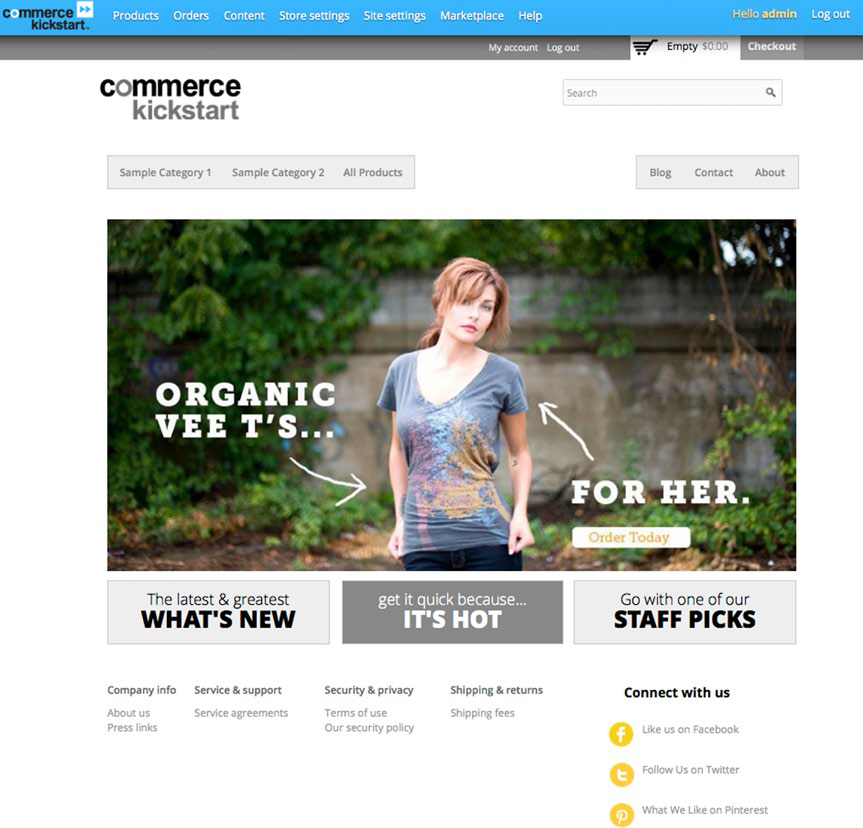

# 构建电子商务网站

**翻译：伟太**

在一个相对较短的20年来，在互联网上销售产品和服务已经从新奇事物变成企业的主流业务。如果你的公司没有提供一个在线渠道给你的目标客户，你正错过一个增加收入、市场份额以及盈利的巨大机会。Drupal Commerce 为构建在线店面提供了强健而且功能完整的解决方案。在本章中，我讲带您完成创建一个电子商务网站的流程。为了演示在 Drupal 上建立电子商务网站的如何方便，我将创建一个专注于销售 Drupal T恤，咖啡杯和帽子的网站。该概念可以扩展到出售任何物理或虚拟货物，所以欢迎你要么跟着我一起构建Drupal的电子商务网站，或者使用呈现的例子作为指导，以创建你自己的电子商务网站。

## 确定一个电子商务网站的需求

正如你多次在本书中读到，下手构建任何网站的开始是，确认该网站的需求。

关于本章介绍的电子商务网站示例的需求对许多电子商务网站来说是通用的，包括：

1. 在网站上展示在售产品的能力。
2. 销售具有特定属性（比如说产品尺寸）的产品的能力。
3. 购物者把产品放进购物车并管理购物车的能力。
4. 购物者结账和支付，包括提供信用卡结账以及选择送货方式，的能力
5. 购物者访问网站并且检查以前的订单的能力。

随着需求在手，我们接着就可以确定我们将如何使用 Drupal 来满足这些需求。使用 Drupal Commerce Kickstart 发行版，在此基础上创建店面。Commerce Kickstart 提供了一个预配置的解决方案，使得许多需求开箱即可实现，包括:

- 用于在网站上创建和展示产品的产品模板，包括具有属性（比如尺寸）的产品。
- 一个可以让访问者将产品放进购物车，并且在包括含提供各种支付方式以及为产品（实物产品）选择运送方式的结账流程在内的购物体验中，管理商品的购物车系统。
- 用以查看以前订单的客户界面

作为一个 Drupal 发行版，Drupal Commerce Kickstart 发行版是由一个团队装配的。这个团队已经将所有贡献模块准备到位，使得你的店面搭建变得容易，并且用最少的功夫让网站迅速运行起来。你也可以跟随 Commerce Kickstart 团队的路径，找到所有等人的模块并且逐个安装。这两种方案我都试过，我发现使用 Kickstart 明显更加快速、简单，所以我会现在更加容易示范的路径，使用 Commerce Kickstart 开始。

## 安装 Drupal Commerce Kickstart

安装 Drupal Commerce Kickstart 的过程除了定制的安装界面，几乎跟安装 Drupal 8 核心 一样。 按着步骤下载 Drupal Commerce Kickstart (www.drupal.org/project/commerce_kickstart) 到你的网页服务器的一个目录中， 完成跟安装 Drupal 核心 一样的基本步骤。创建数据库，数据库用户然后在你的浏览器中打开网站开始铠装过程。

这个过程的第一步是接受隐私政策以及用户协议。这个跟安装 Drupal 8 不一样，因为这个发行版中包含有请求隐私政策以及用户协议同意的第三方库（见图22-1）。如果你同意这些条款，请点击 “Let's Get Started” 按钮。

**图22-1 确认接受隐私政策以及用户协议**

这个过程的下一步是验证安装要求，以便继续进行安装。如果你还没创建 `/sites/default/files` 目录以及 `settings.php`，你可以去这样做。这些步骤跟安装 Drupal 8 核心一样，在文件管理系统中导航到相应的位置并创建它们两个。

验证系统需求验证之后，下一步是指定数据库类型，数据库名称，数据库用户和数据库密码。
除了有一点点区别之外，这个过程跟安装 Drupal 8 核心一样（见图22-2）。你需要（提前）创建那个数据库，或者通过你的主机提供商的管理界面，或者在命令行中使用 MySQL，又或者通过像 PHPMyAdmin 这样的工具。

**图22-2 数据库设置**

输入数据库设置并点击“保存并继续”按钮之后，Drupal Commerce 会在数据库中创建必要的表，并执行所有关于 Drupal 8 核心以及与“ Drupal 商务基础实现”关联的贡献模块的安装、启用操作。图22-3 显示了安装进度。

**图22-3 正在创建数据表并启用模块**

这个过程的下一步是填写你网站的基本信息，具体包括你网站的名称、商店的e-mail地址，商店管理员的用户名和密码，以及商店的国家和时区信息（见图22-4）。商店信息输入完成之后，点击“保存并继续”按钮。

**图22-4 网站配置参数**

这个过程的最后一步是，决定你是否想要从一个实例商店开始，你是否希望将你的网站内容翻译成多语言，你网站的基础货币是什么，以及如果有需要的话，你的网站使用哪一种类型的税率（见图22-5）。为了演示如何建立一个商务网站，我将不会安装那个示范商店，但是我会启用其他所有附加功能来开始创建一个新的商店，并且我会启用美国税率。

**图22-5 配置商店**

点击“创建并完成”按钮，Drupal Commerce 会安装额外的功能并且完成安装流程。访问网站的主页，你可以看一个“入门”弹出窗口，为你提供有关设置网站的丰富的信息。我建议你找个时间将通读一遍。关闭那个弹出窗口会显示默认主页，类似于图22-6。

## 设置产品分类

## 设置产品

## 创建产品

## 展示产品

## 配送、税收、支付以及其他功能

### 配送

### 税收

### 支付

## 本章小结
